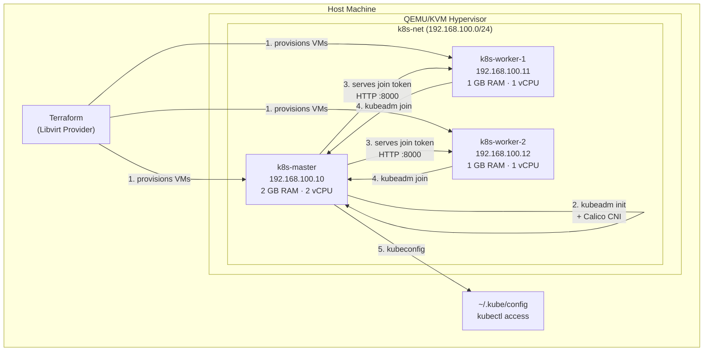

# Local Kubernetes Cluster with Terraform + QEMU/KVM

Provision a production-like 3-node Kubernetes cluster (1 master + 2 workers) on your local machine using Terraform and the libvirt provider. Fully automated with cloud-init and kubeadm — from zero to `kubectl get nodes` in one command.


## Architecture



## How It Works (Fully Automatic)

After `terraform apply`, everything happens without any manual steps:

```
terraform apply
│
├─ Creates libvirt NAT network (192.168.100.0/24)
│
├─ Creates k8s-master VM
│    └─ cloud-init runs automatically:
│         1. Disables swap, SELinux, firewalld
│         2. Installs containerd + kubeadm via dnf
│         3. Runs kubeadm init (creates control plane)
│         4. Installs Calico CNI (pod networking)
│         5. Generates join token
│         6. Starts HTTP server on port 8000
│            (python3 -m http.server serving join-command.sh)
│
├─ Creates k8s-worker-1 VM
│    └─ cloud-init runs automatically:
│         1. Disables swap, SELinux, firewalld
│         2. Installs containerd + kubeadm via dnf
│         3. Polls http://192.168.100.10:8000/join-command.sh
│            (retries every 10s until master is ready)
│         4. Runs kubeadm join automatically
│
└─ Creates k8s-worker-2 VM (same as worker-1)

~5-10 minutes later → kubectl get nodes → 3 nodes Ready ✅
```

> **How workers get the join token:** The master runs a Python HTTP server (systemd service) that serves the `kubeadm join` command as a file. Workers `curl` this URL in a retry loop. No SSH keys needed between nodes.

## Project Structure

```
local-k8s-terraform/
├── terraform/
│   ├── providers.tf              # Libvirt provider configuration
│   ├── variables.tf              # Configurable variables (OS, RAM, CPU, etc.)
│   ├── network.tf                # Libvirt NAT network (DHCP disabled, static IPs)
│   ├── volumes.tf                # Base cloud image + per-node cloned disks
│   ├── master.tf                 # Master node VM + cloud-init selector
│   ├── workers.tf                # Worker node VMs (count-based)
│   ├── outputs.tf                # Node IPs, SSH commands, kubeconfig path
│   └── terraform.tfvars.example  # Example configuration
├── cloud-init/
│   ├── master.yaml               # Ubuntu: apt + kubeadm init + HTTP join server
│   ├── worker.yaml               # Ubuntu: apt + kubeadm join via HTTP
│   ├── fedora-master.yaml        # Fedora/RHEL: dnf + kubeadm init + HTTP join server
│   ├── fedora-worker.yaml        # Fedora/RHEL: dnf + kubeadm join via HTTP
│   └── network-config.yaml       # Static IP assignment template
├── scripts/
│   ├── setup.sh                  # Interactive OS selection + cloud image download
│   ├── get-kubeconfig.sh         # Copy kubeconfig from master to host
│   └── destroy.sh                # Clean teardown of cluster
├── .gitignore
└── README.md
```

## Supported Operating Systems

| OS | Package Manager | Cloud Image | Best For |
|----|----------------|-------------|----------|
| **Fedora 40** (default) | `dnf` | [Fedora Cloud](https://fedoraproject.org/cloud/download) | Matches Amazon Linux / RHEL workflow |
| **Ubuntu 22.04** | `apt` | [Ubuntu Cloud](https://cloud-images.ubuntu.com/) | Debian-based environments |

Select your OS during `scripts/setup.sh` or set `os_distro` in `terraform.tfvars`.

## Prerequisites

- Linux host with KVM support (`/dev/kvm` exists)
- [QEMU/KVM](https://www.qemu.org/) and [libvirt](https://libvirt.org/) installed
- [Terraform](https://www.terraform.io/downloads) >= 1.5.0
- At least 4 GB free RAM (2 GB master + 1 GB × 2 workers)

### Install Terraform (if not installed)

```bash
# Fedora / RHEL
sudo dnf install -y dnf-plugins-core
sudo dnf config-manager --add-repo https://rpm.releases.hashicorp.com/fedora/hashicorp.repo
sudo dnf install -y terraform
```

```bash
# Debian / Ubuntu
sudo apt install -y gnupg software-properties-common
wget -O- https://apt.releases.hashicorp.com/gpg | sudo gpg --dearmor -o /usr/share/keyrings/hashicorp-archive-keyring.gpg
echo "deb [signed-by=/usr/share/keyrings/hashicorp-archive-keyring.gpg] https://apt.releases.hashicorp.com $(lsb_release -cs) main" | sudo tee /etc/apt/sources.list.d/hashicorp.list
sudo apt update && sudo apt install -y terraform
```

## Quick Start

### 1. Clone and Configure

```bash
git clone https://github.com/khadirullah/local-k8s-terraform.git
cd local-k8s-terraform
```

### 2. Run Setup (downloads cloud image + inits Terraform)

```bash
chmod +x scripts/*.sh
./scripts/setup.sh
# → Select OS: Fedora (1) or Ubuntu (2)
# → Downloads cloud image to /var/lib/libvirt/images/
# → Creates terraform.tfvars
# → Runs terraform init
```

### 3. Provision the Cluster

```bash
cd terraform
terraform plan
terraform apply -auto-approve
```

This creates 3 VMs. Cloud-init automatically installs K8s and joins workers to the master. Wait ~5-10 minutes for everything to complete.

### 4. Get Kubeconfig

```bash
cd ..
./scripts/get-kubeconfig.sh
# → Waits for master to be ready
# → Copies kubeconfig to ~/.kube/config-local-k8s
```

### 5. Verify

```bash
export KUBECONFIG=~/.kube/config-local-k8s
kubectl get nodes
```

Expected output:
```
NAME           STATUS   ROLES           AGE   VERSION
k8s-master     Ready    control-plane   5m    v1.30.x
k8s-worker-1   Ready    <none>          3m    v1.30.x
k8s-worker-2   Ready    <none>          3m    v1.30.x
```

## Manual Worker Join (Alternative)

If you prefer to join workers manually (to understand the process):

```bash
# 1. SSH into the master node
ssh km@192.168.100.10

# 2. View the join command
cat ~/join-command.sh
# Output: kubeadm join 192.168.100.10:6443 --token <token> --discovery-token-ca-cert-hash sha256:<hash>

# 3. SSH into a worker node
ssh km@192.168.100.11

# 4. Run the join command as root
sudo kubeadm join 192.168.100.10:6443 --token <token> --discovery-token-ca-cert-hash sha256:<hash>

# 5. Verify from master
kubectl get nodes
```

If the token has expired (tokens expire after 24 hours):
```bash
# On master, generate a new join command
kubeadm token create --print-join-command
```

## Resource Allocation

| Node | RAM | vCPU | Disk | IP |
|------|-----|------|------|----|
| k8s-master | 2 GB | 2 | 20 GB | 192.168.100.10 |
| k8s-worker-1 | 1 GB | 1 | 15 GB | 192.168.100.11 |
| k8s-worker-2 | 1 GB | 1 | 15 GB | 192.168.100.12 |
| **Total** | **4 GB** | **4** | **50 GB** | |

All values are configurable in `terraform.tfvars`.

## Key Design Decisions

1. **Cloud Images over ISOs**: Using official cloud images (Fedora/Ubuntu) with cloud-init instead of ISO installers. VM provisioning is reproducible and fast (~30 seconds per VM boot).

2. **HTTP-based Join Token**: The master serves the `kubeadm join` command via a Python HTTP server (systemd service on port 8000). Workers `curl` this endpoint in a retry loop. This avoids SSH key distribution complexity between nodes.

3. **Calico CNI**: Chose Calico over Flannel for its NetworkPolicy support, which is essential for production-like environments.

4. **kubeadm**: The official Kubernetes bootstrapping tool. Mirrors how production clusters are built and gives full control over cluster configuration.

5. **NAT Network with Static IPs**: VMs use a libvirt NAT network with DHCP disabled. Static IPs are assigned via cloud-init network config, making the cluster deterministic and reproducible.

6. **Fedora as Default**: Fedora uses `dnf`, same as Amazon Linux 2023 and RHEL. Practicing locally on Fedora means the same commands work on AWS.

## What You Can Do After Setup

- Deploy the monitoring stack from [`terraform-eks-monitoring`](https://github.com/khadirullah/terraform-eks-monitoring) K8s manifests
- Deploy the DevSecOps app from [`devsecops-pipeline`](https://github.com/khadirullah/devsecops-pipeline) K8s manifests
- Practice with Deployments, Services, Ingress, RBAC, NetworkPolicies
- Test ArgoCD GitOps workflows locally
- Simulate node failures (stop a VM in virt-manager, watch K8s reschedule pods)

## Cleanup

To completely tear down the cluster and free up your system resources, you can use the provided script:

```bash
./scripts/destroy.sh
```

**Alternatively**, you can run the manual commands:

```bash
cd terraform
terraform destroy -auto-approve

# (Optional) Clean up the downloaded local kubeconfig file:
rm ~/.kube/config-local-k8s
```

## License

MIT License

## Author

**Khadirullah Mohammad** — [khadirullah.com](https://khadirullah.com) | [LinkedIn](https://linkedin.com/in/khadirullah) | [GitHub](https://github.com/khadirullah)
